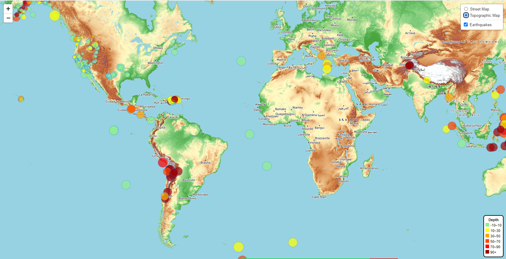

# Leaflet Challenge

## Website: 
[Github Pages](https://jojoalva.github.io/leaflet-challenge/)

## Description
The United States Geological Survey, or USGS for short, is responsible for providing scientific data about natural hazards, the health of our ecosystems and environment, and the impacts of climate and land-use change. Their scientists develop new methods and tools to supply timely, relevant, and useful information about the Earth and its processes.

In this challenge, the task is to develop a way to visualize USGS data that will allow them to better educate the public and other government organizations (and hopefully secure more funding) on issues facing our planet.

This challenge uses Leaflet JS to generate a map of all earthquakes in the last 7 days across the world:

## Table of Contents

- [Installation](#installation)
- [Usage](#usage)
- [Credits](#credits)

- [Features](#features)

- [Contact](#contact)

## Installation
You will need the following installations / coding skills to be able to replicate this project.

Leaflet, Javascript, HTML, CSS

## Usage
    Please download the repository into your local drive, if you do not want to view the site on Github Pages.
    From here, you can view the leaflet code. Please click on **static** folder, **js** folder, and then the **logic.js** file to view the code.
    For the HTML code, please open the **index.html** file within an environment such as VS code.
    For the CSS code, click on **static** folder, **css** folder, and then the **style.ss** file to view the code.

Open the index page using your local browser app, and you can analyse earthquakes based on their magnitude and depth, across the world for the past 7 days.
You can also use the scrollbar on your mouse to zoom in or out of the map. Alternatively, there is a zoom in our out button at the top left of the map.
You can click and drag the map to view areas not showing up on page-load, to further search for other parts of the world.

## Credits
Jo Alva  
Geronimo Perez- tutor via EdX who has assisted in helping me design the CSS styling for the legend.

## Features
You can toggle between a street map or a topographic map option.

## Contact
If there are any questions of concerns, I can be reached at:
##### [github: jojoalva](https://github.com/jojoalva)
##### [email: jyothsna_alva@hotmail.com](mailto:jyothsna_alva@hotmail.com)